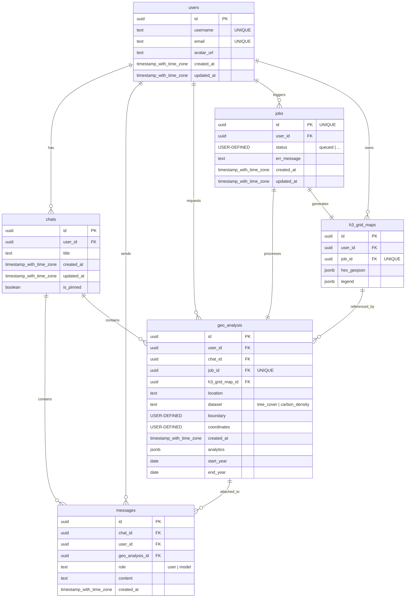

  

# Canopiq: GeoAI Agent for Planetary Carbon 🛰️ & Environmental Monitoring 🌱

Canopiq is an advanced, planetary-scale GeoAI Agent designed to democratize complex environmental monitoring and carbon accounting. By bridging the gap between natural language processing (NLP) and cloud-based remote sensing data, Canopiq enables scientists, academic researchers, and sustainability analysts to estimate biomass carbon sequestration for any geographic location using simple, conversational queries.

Traditional geospatial analysis requires deep expertise in satellite data processing, complex programming languages, and heavy GIS software. Canopiq eliminates this barrier to entry. Users can interact with the platform as if they were speaking to an expert data scientist—asking natural language questions about local tree cover, biomass density, or land-use distribution—and instantly receive structured, visual, and scientifically sound analytical reports.

# ✨ Key Features

- **AI-Driven Geospatial Analysis:** When a user submits a natural language query, the AI pipeline (orchestrated via LangChain and powered by Gemini model) parses the user's intent. It extracts relevant spatial boundaries, timeframes, and environmental parameters, translating the prompt into executable GIS data tasks.

- **GIS Data Processing & Spatial Indexing:** The translated requests are routed to Google Earth Engine (GEE), which performs heavy-lifting computations (such as linear regression models for biomass estimation) across massive satellite datasets from Sentinel-2. To optimize performance and ensure rapid query times, spatial data is binned using Uber's H3 Grid Indexing system, which groups geospatial regions into highly performant hexagonal clusters.

- **Interactive Analytical Dashboard:** The computed results are streamed back in real-time to a responsive frontend dashboard built with React.js and TypeScript. Users can interactively explore their environmental reports via a dynamic React Leaflet 2D map displaying precise H3 grid overlays, accompanied by granular time-series data visualizations powered by Chart.js.

# 🛠️ Tech Stack

- **Frontend:** React.js, TypeScript, Zustand, Chakra UI v3, React Leaflet, Chart.js

- **Backend & Data Validation:** FastAPI, Python, Pydantic

- **Database & Auth & Synchronization:** Supabase (PostgreSQL & Real-Time WebSocket)

- **AI & LLM Orchestration:** LangChain, Gemini AI

- **Geospatial Computing:** Google Earth Engine, GeoPandas, H3

- **Unit/Integration Testing:** Jest, Playwright

# ⚙️ Architecture

# 🗄️ Database Schemas

# 📂 Project Structure

Canopiq is architected as a production-ready monorepo consisting of a decoupled React frontend application and a domain-driven monolithic FastAPI backend pipeline:

	Canopiq/
	├── backend/               # 🐍 FastAPI & Python, Monolith Server, LangChain GeoAI Agent
	├── frontend/              # ⚛️ React & TypeScript, Geospatial Dashboard UI
	├── docker-compose.yml     # Orchestrator spinning up backend, frontend
	├── Makefile               # Developer environment task automations (build, test, run)
	└── README.md              # Main project hub documentation

# 📖 Services Documentation

For more details about technical implementations specific to each service, explore their dedicated documentation hubs: 
- **[Frontend Architecture](./frontend/README.md)**: Explains the MVC-based pattern using Zustand and custom React Hooks controllers, alongside the Jest unit and and Playwright integration testing.
- **[Backend & GeoAI Agent](./backend/README.md)**: Dives into the asynchronous LangChain MCP agentic pipeline, Gemini prompt loops, Google Earth Engine (GEE) satellite computing, and Uber H3 grid indexing with GeoPandas.
