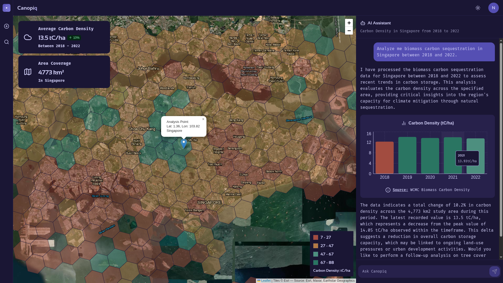
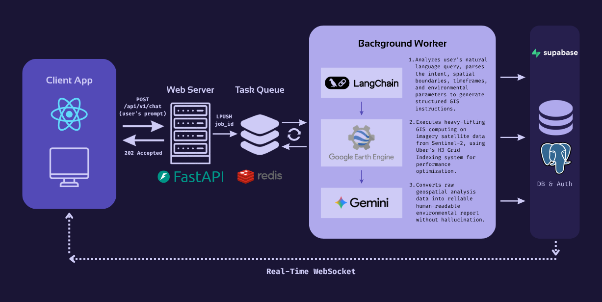

  

# Canopiq: GeoAI Agent for Planetary Carbon 🛰️ & Environmental Monitoring 🌱

Canopiq is an advanced, planetary-scale GeoAI Agent designed to democratize complex environmental monitoring and carbon accounting. By bridging the gap between natural language processing (NLP) and cloud-based remote sensing data, Canopiq enables scientists, researchers, and academic students to estimate biomass carbon sequestration, cover vegetation and land-use distribution for any geographic location using simple, conversational queries.

Traditional geospatial analysis requires deep expertise in satellite data processing, complex programming languages, and heavy GIS software. Canopiq eliminates this barrier to entry. Users can interact with the platform as if they were speaking to an expert data scientist—asking natural-language questions about local tree cover, biomass density, or land cover —and instantly receive structured, visual, and scientifically sound analytical reports.

# ✨ Key Features

- **Graph-Based Multi-Agent Workflow:** When a user submits a natural-language query, an AI pipeline orchestrated via LangGraph and powered by Gemini models parses the user's intent. It extracts relevant spatial boundaries, timeframes, and environmental parameters, translating the prompt into executable GIS data tasks.

- **GIS Data Processing & Spatial Indexing:** The translated requests are routed to Google Earth Engine (GEE) to handle heavy-lifting computations, such as executing linear regression models on Sentinel-2 derived NDVI (Normalized Difference Vegetation Index) for large-scale biomass estimation asynchronously. To ensure rapid query times, spatial data is binned using Uber’s H3 spatial index, grouping geospatial regions into hexagonal cells for optimized querying.

- **Dynamic Markdown Report & Interactive Map:** The computed results are streamed back to a responsive frontend interface built with React.js and TypeScript. Users can interactively explore a dynamic React Leaflet 2D map displaying precise H3 grid overlays and analyze an AI-generated, hallucination-free, rich Markdown report. Instead of a static dashboard layout, time-series data and environmental trends are natively embedded directly within the narrative flow of the generated report using highly reusable Recharts components.

# 🛠️ Tech Stack

- **Frontend:** React.js, TypeScript, Zustand, Chakra UI v3, React Leaflet, Recharts, React Markdown

- **Backend Architecture & Data Validation:** FastAPI, Python, Pydantic, Celery Worker, Redis Queue

- **Database & Auth & Synchronization:** Supabase (PostgreSQL, PostGIS, Real-Time WebSocket)

- **AI & LLM Orchestration:** LangChain, LangGraph, Gemini AI, Graph-based Agentic Workflow, NLP (Natural Language Processing), Prompt Engineering

- **Geospatial Computing:** Google Earth Engine, GeoPandas, H3 Grid Indexing

- **Testing:** Jest

# ⚙️ Architecture

# 🗄️ Database Schema

# 📂 Project Structure

Canopiq is architected as a production-ready monorepo consisting of a decoupled React frontend application and a domain-driven monolithic FastAPI backend pipeline:

	Canopiq/
	├── backend/               # 🐍 FastAPI & Python, Monolith Server, LangChain GeoAI Agent
	├── frontend/              # ⚛️ React & TypeScript, Geospatial Dashboard UI
	├── docker-compose.yml     # Orchestrator spinning up backend, frontend
	├── Makefile               # Developer environment task automations (build, test, run)
	└── README.md              # Main project hub documentation

# 📖 Services Documentation

For more details about technical implementations specific to each service, explore their dedicated documentation hubs: 
- **[Frontend Architecture](./frontend/README.md)**: Explains the MVC-based pattern using Zustand stores (Models) and React custom-hook (Controllers), alongside real-time Supabase sync, heavy GeoJSON rendering on a 2D Leaflet map and React Markdown reports with embedded charts via Recharts components.
- **[Backend & GeoAI Agent](./backend/README.md)**: Dives into the asynchronous LangGraph agentic pipeline, Google Earth Engine (GEE) satellite computing for carbon accounting methodology, and Uber's H3 grid indexing with GeoPandas.
