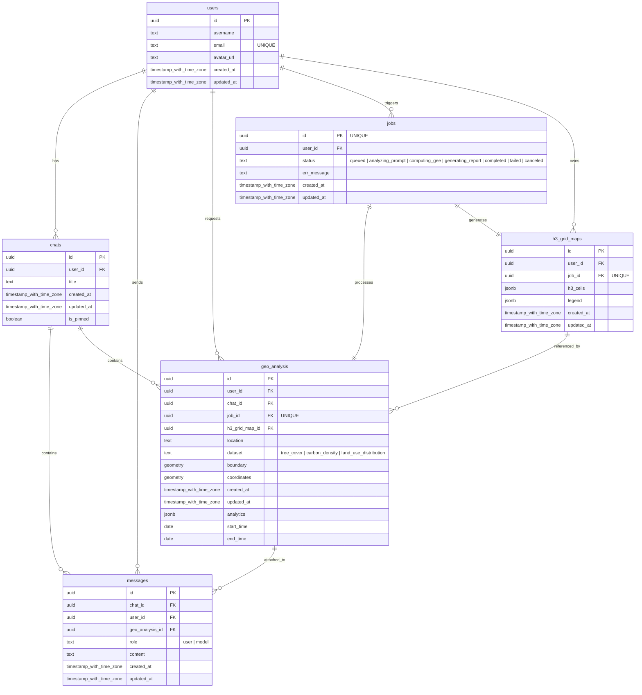

<p align="center">
  
</p>

# Canopiq: GeoAI Agent for Planetary Carbon 🛰️ & Environmental Monitoring 🌱

Canopiq is an advanced, planetary-scale GeoAI Agent designed to democratize complex environmental monitoring and carbon accounting. By bridging the gap between natural language processing (NLP) and cloud-based remote sensing data, Canopiq enables scientists, researchers, and academic students to estimate biomass carbon sequestration, cover vegetation and land-use distribution for any geographic location using simple, conversational queries.

Traditional geospatial analysis requires deep expertise in satellite data processing, complex programming languages, and heavy GIS software. Canopiq eliminates this barrier to entry. Users can interact with the platform as if they were speaking to an expert data scientist—asking natural-language questions about local tree cover, biomass density, or land cover —and instantly receive structured, visual, and scientifically sound analytical reports.


[](https://youtu.be/FfyObRVKAXg)

# ✨ Key Features

- **Graph-Based Multi-Agent Workflow:** When a user submits a natural-language query, an AI pipeline orchestrated via LangGraph and powered by Gemini models parses the user's intent. It extracts relevant spatial boundaries, timeframes, and environmental parameters, translating the prompt into executable GIS data tasks.

- **GIS Data Processing & Spatial Indexing:** The translated requests are routed to Google Earth Engine (GEE) to handle heavy-lifting computations, such as executing linear regression models on Sentinel-2 derived NDVI (Normalized Difference Vegetation Index) for large-scale biomass estimation asynchronously. To ensure rapid query times, spatial data is binned using Uber’s H3 spatial index, grouping geospatial regions into hexagonal cells for optimized querying.

- **Dynamic Markdown Report & Interactive Map:** The computed results are streamed back to a responsive frontend interface built with React.js and TypeScript. Users can interactively explore a dynamic React Leaflet 2D map displaying precise H3 grid overlays and analyze an AI-generated, hallucination-free, rich Markdown report. Instead of a static dashboard layout, time-series data and environmental trends are natively embedded directly within the narrative flow of the generated report using highly reusable Recharts components.

# 🛠️ Tech Stack

- **Frontend:** React.js, TypeScript, Zustand, Chakra UI v3, React Leaflet, Recharts, React Markdown

- **Backend Architecture & Data Validation:** FastAPI, Python, Pydantic, Celery Worker, Redis Queue

- **Database & Auth & Synchronization:** Supabase (PostgreSQL, PostGIS, Real-Time WebSocket)

- **AI & LLM Orchestration:** LangChain, LangGraph, Gemini AI, Graph-based Agentic Workflow, NLP (Natural Language Processing), Prompt Engineering

- **Geospatial Computing:** Google Earth Engine, H3 Grid Indexing

- **Testing:** Jest

# ⚙️ Architecture


# 🗄️ Database Schema



# 📂 Project Structure

Canopiq is architected as a production-ready monorepo consisting of a decoupled React frontend application and a domain-driven monolithic FastAPI backend pipeline:

	Canopiq/
	├── backend/               # 🐍 FastAPI & Python, Monolith Server, LangChain GeoAI Agent
	├── frontend/              # ⚛️ React & TypeScript, Geospatial Dashboard UI
	├── docker-compose.yml     # Orchestrator spinning up backend, frontend
	├── Makefile               # Developer environment task automations (build, test, run)
	└── README.md              # Main project hub documentation

# 📖 Services Documentation

For more details about technical implementations specific to each service, explore their dedicated documentation hubs: 
- **[Frontend Architecture](./frontend/README.md)**: Explains the MVC-based pattern using Zustand stores (Models) and React custom-hook (Controllers), alongside real-time Supabase sync, heavy GeoJSON rendering on a 2D Leaflet map and React Markdown reports with embedded charts via Recharts components.
- **[Backend & GeoAI Agent](./backend/README.md)**: Dives into the asynchronous LangGraph agentic pipeline, Google Earth Engine (GEE) satellite computing for carbon accounting methodology, and Uber's H3 grid indexing.

# 📋 Prerequisites

Before setting up the project and configuring external cloud services, ensure your local development machine meets the following requirements:

- **Docker & Docker Compose:** Required to orchestrate and run the frontend, backend, and background worker containers simultaneously.
- **Make / Linux Environment:** The project includes a Makefile for task automation (building, testing, and running).

    - *macOS / Linux:* make is typically pre-installed or available via build essentials.

    - *Windows:* We highly recommend using WSL 2 (Windows Subsystem for Linux) to run the Makefile commands and Docker seamlessly.
- **Git:** To clone the repository.

# 🚀 Local Setup & Installation

To run Canopiq locally, you'll need to set up a few external cloud services for the database, geospatial computing, and AI orchestration. Follow these steps to get your environment ready.

## 1. Clone the Repository

First, clone the project repository from GitHub to your local environment and navigate into the root folder:

```bash
git clone https://github.com/Harilala42/Canopiq.git
cd Canopiq
```

## 2. Database Setup (Supabase & PostGIS)
Canopiq relies on Supabase for its PostgreSQL database, real-time syncing, and authentication capabilities.

- Create a new project on [Supabase](https://supabase.com/).

- Navigate to the **SQL Editor** in your Supabase dashboard.

- Copy and paste the contents of **backend/db.sql** into the editor and run it to initialize the database schema.

> \[!TIP]
> Don't forget to enable the **PostGIS** extension in your Supabase database settings (usually under **Database > Extensions**), as it is required to enable support for storing and managing geospatial data like Points and Polygons.

## 3. External API Services Configuration

You will need a few API keys to power the backend pipeline:

- **LLM Orchestration:** Get a *Gemini API Key* from [Google AI Studio](https://aistudio.google.com/).

- **Redis Queue:** Create a free serverless *Redis database* on [Upstash](https://upstash.com/) for the task worker queue.

- **Geospatial Computing:** Initialize a new project on [Google Earth Engine](https://earthengine.google.com/) (GEE). Generate a **Service Account** and download the **.json key** file.

    - Place this downloaded .json file directly inside the **/backend** directory (e.g., backend/canopiq-key.json).

## 4. Environment Variables

Create a **.env** file in both the **/backend** and **/frontend** directories. Fill in the missing values with the credentials you generated in the previous steps.

### Backend (backend/.env)

```bash
FRONDEND_URL=http://localhost:3000
BACKEND_URL=http://localhost:8000

# GEE Account Key
SERVICE_ACCOUNT=<your-gee-service-account-email@project.iam.gserviceaccount.com>
SERVICE_ACCOUNT_FILE=<project-key.json>	# Name of the JSON file you put in the backend folder

# Database on Supabase
SUPABASE_URL=<your_supabase_project_url>
SUPABASE_SERVICE_ROLE_KEY=<your_supabase_service_role_key>

# Gemini API Key
GEMINI_API_KEY=<your_gemini_api_key>
GEMINI_MODEL=gemini-3.1-flash-lite

# Redis Store on UpStash
UPSTASH_REDIS_URL=<your_upstash_redis_url>
```

### Frontend (frontend/.env)

```bash
# Server Url
VITE_API_URL=http://localhost:8000
VITE_SUPABASE_URL=<your_supabase_project_url>
VITE_SUPABASE_PUBLISHABLE_KEY=<your_supabase_publishable_key>

# Routes Authentication
VITE_API_AUTH_REGISTER=/api/v1/auth/register
VITE_API_AUTH_LOGIN_WITH_PASSWORD=/api/v1/auth/login
VITE_API_AUTH_LOGIN_WITH_GOOGLE=/api/v1/auth/google
VITE_API_AUTH_LOGOUT=/api/v1/auth/logout
VITE_API_AUTH_REFRESH_TOKEN=/api/v1/auth/refresh
VITE_API_AUTH_GET_SESSION=/api/v1/auth/session
VITE_API_AUTH_GET_ME=/api/v1/auth/me

# Routes LLM
VITE_API_CHAT=/api/v1/chat
VITE_API_CHAT_NEW=/api/v1/chat/new
VITE_API_CHAT_MESSAGE=/api/v1/chat/{chat_id}
VITE_API_CHAT_TOGGLE_PIN=/api/v1/chat/{chat_id}/pin

# Routes Geo-Analysis
VITE_API_GEO_ANALYSIS=/api/v1/geo-analysis/{chat_id}
VITE_API_GEO_ANALYSIS_MAP=/api/v1/geo-analysis/map/{h3_grid_map_id}

# Routes Job
VITE_API_JOB=/api/v1/job/{job_id}
```

## 5. API Documentation

Once the application is running, you can access the **API documentation** at:

    http://localhost:8000/docs

This Swagger UI interface allows you to inspect and test all backend endpoints directly from your browser.

## 6. Booting Up the Application

Once your **.env** files are configured and the Earth Engine **.json** key is in the **backend/** folder, you can use the provided **Makefile** to quickly spin up, spin down, or completely reset the application environment.

You can execute these commands from the root directory of the project:

- **Start the Application:**
Runs the containers in detached mode (in the background) and rebuilds any modified images.

```bash
	make build
```

- **Stop and Clean Containers:**
Stops the running containers, removes them, and prunes unused Docker data to clear up system cache.

```bash
	make clean
```

- **Full Hard Reset (Deep Clean):**
Stops the application, wipes out all local Docker volumes (including persistent database volumes), and clears out cached Docker images. Use this if you want a completely fresh state.

```bash
	make fclean
```

- **Quick Restart:**
Combines **clean** and **build** to efficiently stop the stack and spin it right back up.

```bash
	make restart
```

# 📄 License

This project is open-source and available under the **MIT License**.

---

💡 Find this project interesting? Feel free to leave a ⭐ star or open an issue with feedback. It helps me improve my work and keeps me motivated to build more!
