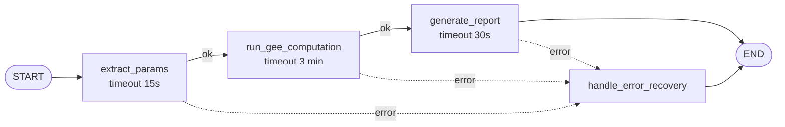
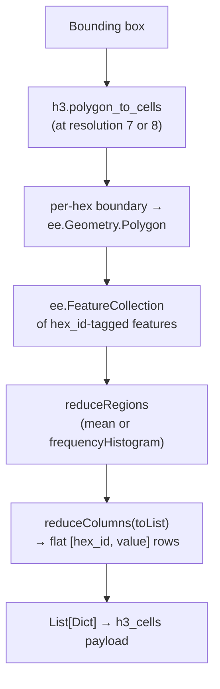

# Canopiq — Backend Architecture

**Canopiq** is a GeoAI agent that turns natural-language requests into satellite-derived
environmental analytics. It lets a researcher ask something like *"How has tree cover
changed in the Betsiboka Delta since 2018?"* and receive a calibrated, map-ready
answer — without touching a GIS console or writing a line of Earth Engine code.

This document describes the three engineering pillars behind that experience:

1. **[LangGraph-orchestrated multi-agent workflow & LangChain tools](#1-langgraph-orchestrated-multi-agent-workflow)**
   — how a prompt becomes a resilient, asynchronous pipeline of specialized LLM agents.
2. **[Carbon accounting methodology](#2-carbon-accounting-methodology--remote-sensing-based-biomass-downscaling)**
   — how coarse global biomass datasets are downscaled with Sentinel-2 imagery.
3. **[Uber H3 grid indexing](#3-uber-h3-grid-indexing)**
   — how raw raster output becomes a fast, hexagonal, map-renderable layer.

### Stack at a glance

| Layer | Technology |
|---|---|
| Orchestration | LangGraph `StateGraph` (async), Celery (background job dispatch) |
| Reasoning | Google Gemini via `langchain-google-genai`, structured output via Pydantic v2 |
| Geospatial compute | Google Earth Engine (GEE) Python API |
| Spatial indexing | Uber H3 (hexagonal hierarchical grid), boundary reconstruction via `h3-js` on the client |
| Persistence | Supabase (Postgres) |
| Geocoding | OpenStreetMap Nominatim |

---

## 1. LangGraph-Orchestrated Multi-Agent Workflow

### 1.1 Entry point: from chat message to background job

A user prompt does not call the pipeline directly. It first passes through an
**intent-classification agent** (`classify_user_request`) that routes the message to one
of four outcomes — `conversational`, `geospatial_analysis`, `impossible_request`, or
`error` — using both the current message and the last assistant turn as context. Only
`geospatial_analysis` requests are worth the cost of a full satellite computation, so
this classifier acts as a cheap gate in front of the expensive path described below.

Once a request is classified as `geospatial_analysis`, it is dispatched as a **Celery
task** (`run_geospatial_pipeline`), which:

- uses the Celery task ID as the `job_id` for progress tracking;
- pulls the last 5 messages of chat history as `recent_context`;
- builds the initial LangGraph state; and
- bridges the sync Celery worker into the async graph via `asyncio.run(graph.ainvoke(...))`.

This separates *conversational latency* (instant classification/replies) from *analytical latency* (multi-minute satellite computation). The frontend subscribes to a real-time Supabase WebSocket channel, listening for live row updates filtered by the task's unique ID (`job_id`).

### 1.2 The state machine

The pipeline's shared memory is a single `TypedDict`, `CanopiqState`, threaded through
every node:

```python
class CanopiqState(TypedDict):
    user_prompt: str
    recent_context: list
    geo_params: NotRequired[GeoSpatialQuery]        # extracted GIS parameters
    geo_analysis_id: NotRequired[UUID]              # GEE computation result reference
    report: NotRequired[str]                        # final environmental report
    recovery_reply: NotRequired[str]                # friendly failure message
    pipeline_stage: NotRequired[PipelineStage]      # current stage, for progress/error UX
```

`PipelineStage` is an enum (`analyzing_prompt`, `computing_gee`,
`generating_report`) that is both a graph-internal marker and the literal string
surfaced to the frontend as job progress — one enum, two consumers.

### 1.3 The graph: three nodes, one linear path



| Node | Responsibility | Backing agent | Tools bound |
|---|---|---|---|
| `extract_params` | Parses the prompt into a structured `GeoSpatialQuery` (location, dataset, bbox, dates) | `extract_geospatial_params` | `search_location` |
| `run_gee_computation` | Executes the GEE analysis for the resolved dataset and persists it | — (pure compute, no LLM) | — |
| `generate_report` | Turns the persisted analysis into a scientific markdown report | `generate_environmental_report` | `normalizeGeoAnalysisData` |

Each node is registered with its own **timeout** and **retry policy**, and every node
shares the same `error_handler`, so a failure at any stage degrades gracefully instead of
surfacing a raw exception to the user.

### 1.4 Retry design: two policies for two failure domains

Canopiq distinguishes LLM-call failures from satellite-compute failures, because they
fail differently and recover on different timescales.

```python
LLM_RETRY_POLICY = RetryPolicy(
    max_attempts=3, initial_interval=1.0, backoff_factor=2.0,
    max_interval=10.0, jitter=True, retry_on=llm_retry_on
)

GEE_RETRY_POLICY = RetryPolicy(
    max_attempts=3, initial_interval=5.0, backoff_factor=2.0,
    max_interval=30.0, jitter=True
)
```

- **`extract_params` and `generate_report`** use `LLM_RETRY_POLICY` with a custom
  predicate, `llm_retry_on`, that only retries *transient* failures: HTTP 429/500/502/503/504
  from `httpx.HTTPStatusError`, plus network-level errors (connect/read/write/pool
  timeouts, dropped connections). Everything else — including malformed model output or
  4xx client errors — fails fast rather than wasting retries on a non-transient bug.
- **`run_gee_computation`** uses `GEE_RETRY_POLICY` with LangGraph's default retry
  classification, since GEE client exceptions aren't `httpx`-shaped. It compensates with
  a longer initial backoff (5s vs 1s) and a higher ceiling (30s vs 10s), matching the
  reality that satellite tile computation recovers on a slower cadence than an LLM call.

Both policies add jitter to avoid thundering-herd retries when the underlying service is
recovering from an outage.

### 1.5 Unified error recovery

`handle_error_recovery` is registered on all three nodes. Rather than three bespoke
handlers, it uses `state["pipeline_stage"]` to pick the right context and delegates to
the conversational LLM to translate the failure into something a researcher can act on:

- **Failed at `LLM_EXTRACT`** → asks the user to rephrase their request.
- **Failed at `GEE_COMPUTE`** → generates a recovery message grounded in the resolved
  location, dataset, and date range, so the user knows exactly what was attempted.
- **Failed at `LLM_REPORT`** → tells the user their satellite data was *already*
  retrieved successfully and only the write-up failed — an important distinction, since
  the underlying analysis is not lost and doesn't need to be recomputed.

The handler updates job progress to `failed` (with the technical error persisted for
observability), saves the friendly reply to the chat, and returns
`Command(update={"recovery_reply": reply}, goto=END)` — short-circuiting the graph
cleanly regardless of which node raised.

### 1.6 The LangChain agent layer

Four purpose-built agents, all built on `create_agent` over the same `ChatGoogleGenerativeAI`
instance (Gemini, `temperature=0.2` for low-variance structured output), each scoped to
one job:

| Agent | Structured output | Tools | Job |
|---|---|---|---|
| `classify_user_request` | `RequestClassification` | — | Route the incoming message |
| `extract_geospatial_params` | `GeoSpatialQuery` | `search_location` | Resolve location → coordinates + bbox, dataset, date range |
| `generate_environmental_report` | `EnvironmentalReport` | `normalizeGeoAnalysisData` | Compact GEE output → scientific markdown report |
| `generate_conversational_reply` | *(free text)* | — | Greetings, follow-up Q&A, and all recovery messaging |

Every extraction/report agent enforces its output shape via Pydantic (`response_format`),
so downstream nodes consume validated data rather than parsing free text. `GeoSpatialQuery`
itself carries domain-level guarantees beyond typing — a `field_validator` checks bbox
coordinate ordering and ranges, and a `model_validator` enforces that
`land_use_distribution` queries **never** carry a date range while `tree_cover` /
`carbon_density` queries **always** do (with `start_time < end_time`). Invalid parameter
combinations are rejected before a single GEE call is made.

The extraction prompt also carries the app's own guardrails: it forbids inferring
coordinates itself (delegating that to the `search_location` tool), it resolves
pronoun/shorthand follow-ups ("what about there?", "same period") against chat history,
and it hard-codes the platform's temporal floor (Sentinel-2 launch, 23 June 2015) so
`impossible_request` cases are caught before extraction ever runs.

### 1.7 The tool layer

Two `@tool`-decorated functions, each bound to exactly one agent:

- **`search_location`** — geocodes a free-text place name via the OpenStreetMap Nominatim
  API and returns `{location, latitude, longitude, bbox}`. Used by the extraction agent
  to ground a vague place name into the coordinates the GEE stage needs.
- **`normalizeGeoAnalysisData`** — fetches a saved GEE result from Supabase and compacts
  its nested `analytics.stats` / `metadata` / `insights` payload into a small,
  dataset-aware summary (top-3 dominant classes for categorical data; latest/peak value
  for time series). This keeps the report agent's context small and factual, reducing
  both token cost and hallucination surface compared to handing it the raw analysis blob.

### 1.8 Report generation as a UI contract, not just prose

The report agent's prompt is worth calling out as a design pattern: it doesn't just ask
for markdown, it asks for a **typed directive** embedded in a fenced code block —
```` ```biomass_trends {"geo_analysis_id": "..."} ``` ```` for time-series data, or
```` ```land_use_distribution {"geo_analysis_id": "..."} ``` ```` for categorical data —
with the invariant that exactly one such block appears, matching the dataset kind the
tool actually returned. The frontend chat renderer intercepts these blocks to mount an
interactive chart/map component inline, while the surrounding prose is constrained to
interpret the numbers rather than describe the chart ("do not describe chart visuals —
charts render inline"). The LLM is effectively generating a small piece of UI wiring, not
just text.

---

## 2. Carbon Accounting Methodology — Remote Sensing-Based Biomass Downscaling

### 2.1 The problem

Canopiq supports two continuous, time-series datasets — `carbon_density` and
`tree_cover` — both ultimately answerable from *global* reference products:

- **WCMC `biomass_carbon_density/v1_0`** for above-ground biomass carbon density
- **MODIS `MOD44B` `Percent_Tree_Cover`** for tree canopy percentage

Both are authoritative but coarse and, in MODIS's case, temporally sparse relative to
what a researcher wants when zooming into a specific delta, reserve, or city. Sentinel-2,
by contrast, revisits every ~5 days at 10–20m resolution but doesn't directly measure
biomass or tree cover — it measures reflectance.

Canopiq's `compute_biomass_trend` function bridges the two with a lightweight,
**self-calibrating regression downscaling** approach: it uses Sentinel-2's vegetation
signal as a high-resolution proxy, statistically calibrated against the coarse reference
product for the specific region and time window being analyzed.

### 2.2 The pipeline

1. **Sentinel-2 retrieval & cloud masking.** Both the Level-2A (surface reflectance,
   `COPERNICUS/S2_SR_HARMONIZED`) and Level-1C (`COPERNICUS/S2_HARMONIZED`) collections
   are filtered to the region and date range, restricted to scenes under 30% cloudy-pixel
   percentage, and masked pixel-by-pixel using the `QA60` band's cloud and cirrus bits.
   Surface reflectance is preferred when available; top-of-atmosphere is used as a
   fallback (and as the fixed source for the time series, for temporal consistency).
2. **NDVI as the biomass proxy.** A median NDVI (`(B8 − B4) / (B8 + B4)`) is computed
   across the filtered collection — a standard, well-validated proxy for vegetation
   density and vigor.
3. **Reference layer selection.** Depending on the requested dataset, the matching
   reference image is clipped to the region of interest (WCMC biomass for
   `carbon_density`, MODIS tree-cover percentage for `tree_cover`).
4. **Linear calibration (the "downscaling" step).** GEE's `Reducer.linearFit()` regresses
   the reference variable against the median NDVI over the region, yielding a `scale`
   (slope) and `offset` (intercept):

   ```
   predicted = NDVI * scale + offset
   ```

   This single regression, fit once per request against the *coarse* reference product,
   is then applied pixel-by-pixel to the *fine-resolution* NDVI image — effectively
   projecting the coarse product's information onto Sentinel-2's spatial grid. The result
   is masked to positive-NDVI (vegetated) pixels and renamed `biomass`.
5. **Historical time series, reusing the same calibration.** Rather than re-fitting a
   regression for every month (expensive, and unstable on partial-coverage months), the
   same `scale`/`offset` pair is applied to each month's median NDVI to reconstruct a
   monthly trend line. Months with no valid Sentinel-2 imagery are explicitly flagged and
   excluded (`valid: 0`) rather than interpolated or zero-filled.
6. **Region-wide stats + legend.** `reduceRegion(minMax)` over the predicted image
   produces the value range used to build an evenly-spaced legend against the
   dataset-specific color palette.

### 2.3 Land-use distribution: a deliberately different methodology

`land_use_distribution` is not a downscaling problem — it's a direct categorical
classification (ESA `WorldCover/v200`), already produced at 10m resolution, so it is
reported as-is: a `frequencyHistogram` reduction gives region-wide class percentages for
the summary chart, with no time dimension (WorldCover is a snapshot product, and the
extraction schema enforces `start_time = end_time = null` for this dataset specifically).

### 2.4 Methodology notes & limitations

In the interest of representing this accurately rather than over-claiming precision:

- The NDVI-to-reference regression is fit **once per request**, over the full bounding
  box and, for the snapshot fit, a single point in time. It assumes the NDVI↔biomass
  relationship is locally stable across the region — a reasonable simplification for
  relative trend detection within one ROI, but not a substitute for plot-level,
  field-calibrated biomass inventories.
- Because the regression is empirical (statistical) rather than a physically-parameterized
  biomass model (e.g. allometric equations), outputs are best read as **calibrated
  relative indicators of change** rather than certification-grade absolute carbon stock
  figures.
- A hard 10,000 km² area ceiling (enforced in `_get_dynamic_h3_resolution_and_scale`)
  keeps both the regression and the hex aggregation computationally tractable within
  GEE's `bestEffort` reduction budget.

---

## 3. Uber H3 Grid Indexing

### 3.1 Why hexagons

Every analysis — whether a continuous downscaled raster or a categorical land-cover
classification — needs to become a discrete set of shapes the frontend map can render
and the user can click. Canopiq uses **Uber H3**, a hierarchical hexagonal grid, instead
of a raw raster tile or square grid, for two practical reasons: hexagons have uniform
adjacency (every neighbor is equidistant, unlike a square grid's edge/corner distinction),
and H3's resolution hierarchy lets the same code path serve both a neighborhood-scale
query and a country-scale one just by changing one parameter.

### 3.2 Dynamic resolution: balancing detail against compute cost

```python
def _get_dynamic_h3_resolution_and_scale(area_ha: float) -> Tuple[int, int]:
    area_km2 = area_ha / 100
    if area_km2 >= 10000:
        raise Exception("... exceeds the maximum regional processing limit of 10,000 km².")
    h3_resolution = 8 if area_km2 < 1000 else 7
    current_scale = 500 if h3_resolution == 8 else 1000
    return h3_resolution, current_scale
```

Small regions (<1,000 km², e.g. a district or protected reserve) get **H3 resolution 8**
(~0.7 km² hexagons) paired with a 500m GEE extraction scale — fine enough to show
meaningful spatial variation without either producing an overwhelming hex count. Larger
regions (up to the 10,000 km² ceiling, e.g. a full watershed or subnational area) fall
back to **resolution 7** (~5.2 km² hexagons) with a 1000m extraction scale, keeping the
hex count — and therefore the GEE `reduceRegions` cost and the payload size shipped to
the frontend — bounded regardless of how large the requested region is.

### 3.3 From bounding box to Earth Engine geometry



`_generate_gee_h3_grid` converts the request bbox into an H3 `LatLngPoly`, enumerates
every covering hex ID with `h3.polygon_to_cells`, and re-projects each hex's boundary
(note the explicit lat/lng → lon/lat flip, since H3 and GEE disagree on axis order) into
an `ee.Geometry.Polygon`. Each hex becomes an `ee.Feature` tagged with its `hex_id`,
collected into a single `ee.FeatureCollection` — the vector layer that all subsequent
zonal statistics run against.

### 3.4 Zonal aggregation: matching the reducer to the data type

The same H3 `FeatureCollection` is reduced two different ways depending on whether the
underlying raster is continuous or categorical:

- **Continuous data** (predicted biomass/tree-cover): `reduceRegions` with
  `Reducer.mean()` gives each hex its average predicted value, surfaced downstream as
  `percent`. Hexes with no valid signal are dropped **before** any data leaves Earth
  Engine — `.filter(ee.Filter.gt('mean', 0))` runs server-side on the `FeatureCollection`
  itself, so a zero-signal hex never shows up as a false zero and never costs a byte of
  transfer.
- **Categorical data** (WorldCover classes): `reduceRegions` with
  `Reducer.frequencyHistogram()` gives each hex a full class-count histogram. Because a
  histogram can't be filtered with a simple Earth Engine predicate the way a scalar mean
  can, the **majority class** (`max(histogram, key=histogram.get)`) is resolved in the
  Python loop that follows extraction instead, surfaced downstream as `class`; hexes with
  an empty histogram or an unrecognized class ID are skipped there.

Both reductions set `tileScale=4`, trading a bit of latency for a lower per-tile memory
footprint — necessary headroom for the larger, resolution-7 regions near the 10,000 km²
ceiling.

### 3.5 From Earth Engine to a lean H3 payload

Once `reduceRegions` has produced a per-hex statistic (a `mean` for continuous data, a `histogram` for categorical data), that result is extracted directly as flat rows rather than as a collection of geometry-bearing features:

```python
raw_data = reduced_hex.reduceColumns(
    reducer=ee.Reducer.toList(2),
    selectors=['hex_id', 'mean']       # or ['hex_id', 'histogram'] for land cover
).get('list').getInfo()
```

`reduceColumns(toList(2))` runs *inside* Earth Engine, collapsing the `FeatureCollection` down to a plain list of `[hex_id, value]` pairs before anything crosses the network. The single `getInfo()` call at the end pulls back only those two columns per hex — nothing else is computed, tagged, or transferred. From there, a short Python loop turns each raw pair into a finished record:

- **Continuous layer.** Each `mean` value is min-max normalized against the region's `reduceRegion(minMax)` range and mapped to an index in the dataset's color palette (`['#a34b3c', '#b37a3f', '#4b907f', '#287662']` for carbon density, a white-to-green ramp for tree cover) via `map_val_to_color`. Each hex becomes `{hex_id, percent, color}`.
- **Categorical layer.** Each hex's `histogram` — a class-ID-to-pixel-count dictionary — is resolved to its majority class via `max(histogram, key=histogram.get)`, then mapped through the fixed 11-class ESA WorldCover legend (`LAND_COVER_CLASSES`) to get a label and color. Each hex becomes `{hex_id, class, color}`; hexes with an empty histogram or an unrecognized class ID are skipped in this same pass.
- **Legend construction.** This runs independently of the per-hex loop, against the two region-wide aggregates computed earlier: for continuous data, `reduceRegion(minMax)`'s value range is split into even-width buckets matching the palette length; for categorical data, the legend is the subset of the fixed 11-class table that actually shows up in the region-wide `frequencyHistogram`, so the frontend never renders a legend entry for a land-cover class that isn't present.

The result is a plain `List[Dict[str, Any]]` — one small dictionary per hex, keyed by `hex_id`. This is what ships in the GEE computation's return payload (`h3_cells`), alongside the time series or land-use percentages. Each record carries only what the map actually needs to render and color a hex; the hex's boundary itself is never part of the payload — it's derived on the frontend from the `hex_id` at render time.

---

## Engineering highlights

- **Two-speed retry design** — transient-aware retries for LLM/network calls, longer
  patient backoff for satellite compute, both jittered against correlated failures.
- **Stage-aware, single-path error recovery** — one handler, three prompt templates,
  always ending in a friendly persisted chat message instead of a dead job.
- **Structured-output contracts everywhere** — every LLM boundary (classification,
  extraction, reporting) is Pydantic-validated before it can propagate downstream.
- **Self-calibrating downscaling** — no pre-trained model to maintain; each request
  fits its own regression against the region and time window it actually concerns.
- **Area-aware H3 resolution** — a single dynamic rule keeps compute and payload size
  bounded from a city block up to the platform's 10,000 km² ceiling.
- **Geometry-free hex payloads** — `reduceColumns(toList)` extracts flat
  `[hex_id, value]` rows, and the hex boundary is reconstructed once, client-side, from
  the H3 index itself.
