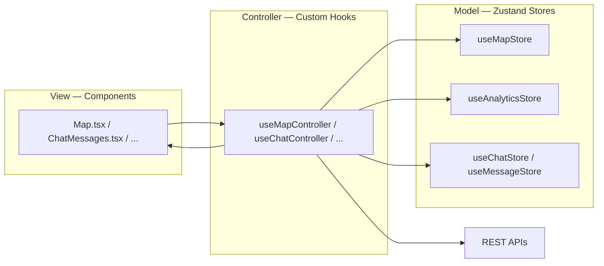
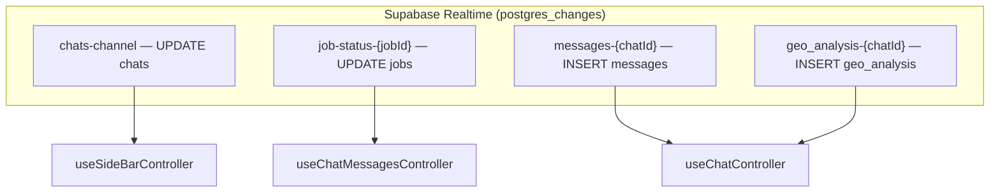
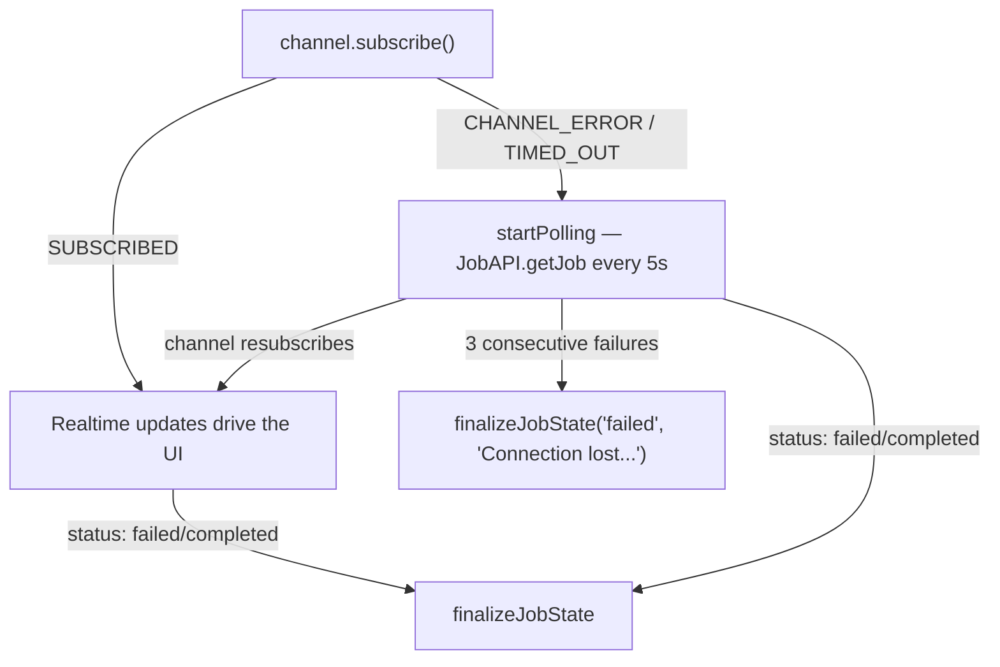
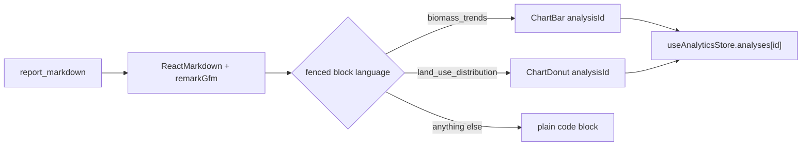

# Canopiq — Frontend Architecture

This document covers the client half of Canopiq: a React + TypeScript app that turns a
Celery/LangGraph job running somewhere in the background into a live, map-and-chart-driven
chat experience. It complements the [backend architecture doc](../backend/README.md) —
several patterns here exist specifically to consume what that pipeline produces.

Three parts:

1. **[An MVC-inspired split between Zustand stores and custom-hook controllers](#1-mvc-inspired-pattern-hooks-as-controllers-stores-as-models)**
2. **[Real-time Supabase sync, and rendering lightweight H3 Cell data on a 2D Leaflet map](#2-real-time-supabase-updates--lightweight-h3-grid-rendering)**
3. **[Markdown reports with embedded, store-backed Recharts components](#3-react-markdown-reports-with-embedded-recharts-components)**

### Stack at a glance

| Layer | Technology |
|---|---|
| State | Zustand (4 domain stores) |
| Business logic / orchestration | Custom hooks ("controllers") |
| Real-time sync | Supabase Realtime (`postgres_changes`) |
| Map rendering | `React-Leaflet` (canvas renderer) + `h3-js` for client boundary generation |
| Charts | Recharts |
| Report rendering | `react-markdown` + `remark-gfm` |
| UI kit | Chakra UI |
| Testing | Per-hook/per-store `.test.ts` files with dedicated `__mocks__` |

---

## 1. MVC-Inspired Pattern: Hooks as Controllers, Stores as Models

Canopiq's frontend maps the classic MVC split onto React fairly literally:



- **Model — Zustand stores** hold state and the pure mutations on it. `useMessageStore`,
  `useMapStore`, `useChatStore`, and `useAnalyticsStore` never call an API and never touch
  a `useEffect`; each is just a state shape plus setters (`addMessage`, `updateQuery`,
  `setActiveAnalysis`, and so on). Two shapes recur deliberately: `maps` and `analyses`
  are both keyed dictionaries (`Record<string, T>`) rather than arrays, which turns
  by-ID lookups (used constantly by the map and chart components — see Parts 2 and 3)
  into O(1) access instead of a `find()` scan on every render.

- **Controller — custom hooks** (`useMapController`, `useChatController`,
  `useChatInputController`, `useChatMessagesController`, `useSideBarController`, `useRenameQueryDialogController`, `useMenuOptionsController`) are where
  the actual application logic lives: they call the API layer, own the Supabase realtime
  subscriptions, coordinate *multiple* stores at once, and translate raw state into the
  narrow, presentation-ready shape a component actually needs. `useMapController` is a
  clean example — it exposes exactly `{ map, coords, location, legend }`, hiding the
  cache lookup, the coordinate-order conversion, and the fetch-if-missing logic behind
  that surface.

- **View — components** stay close to pure rendering. `Map.tsx` calls one hook
  (`useMapController()`) and renders based on what comes back; it has no idea a
  Supabase client, an Axios instance, or a Zustand store exist.

### A deliberate wrinkle: cross-store coordination lives in the Model, not the Controller

Strict MVC would keep stores fully independent, but a few places intentionally break that
purity for consistency's sake. `useChatStore.deleteQuery` reaches into `useMapStore`,
`useMessageStore`, and `useAnalyticsStore` directly to cascade a reset when the *active*
query is deleted:

```typescript
deleteQuery: (id) => {
    const { currentQuery } = get();
    const { clearMap } = useMapStore.getState();
    const { resetMessages } = useMessageStore.getState();
    const { resetAnalyses } = useAnalyticsStore.getState();

    if (currentQuery?.id === id) {
        clearMap();
        resetMessages();
        resetAnalyses();
    }
    // ...
}
```

Similarly, `useMapStore.getOwnerAnalysis` reads `useAnalyticsStore.getState()` to resolve
which analysis owns a given map ID. This is a conscious tradeoff: it keeps *cascading
invalidation* (deleting a chat should never leave a stale map or stale chart on screen)
correct-by-construction inside the Model layer itself, rather than trusting every
Controller that might call `deleteQuery` to remember to clean up three other stores. The
cost is that these two stores aren't fully decoupled — acceptable here since the coupling
is one-directional and narrow (cleanup + a single lookup), not a general dependency.

### Controller responsibilities at a glance

| Controller | Stores composed | Owns |
|---|---|---|
| `useSideBarController` | Chat, Map, Message, Analytics | Query list, sorting (pinned → recency), chat CRUD, realtime title sync |
| `useChatController` | Chat, Message, Analytics, Map | Initial message/analysis load per chat, realtime message + analysis inserts |
| `useChatInputController` | Message, Chat | Optimistic send, job dispatch, cancellation |
| `useChatMessagesController` | Message, Chat | Auto-scroll, realtime job-status updates |
| `useMapController` | Map, Analytics | Cache-aware map fetch, coordinate normalization |
| `useRenameQueryDialogController` | Chat | Query rename, dialog state |
| `useMenuOptionsController` | Chat | Query deletion, pin toggling

### Why this pays off: testability

The file tree shows every Controller hook and every Store paired with a `.test.ts` file, backed by a parallel `__mocks__` directory for stores, APIs, and contexts. That's the direct payoff of this architecture—because Controllers depend on Stores and APIs through consistent import boundaries, both are trivially mockable in isolation, and component tests never require a live Supabase instance or backend. The result is a fast, deterministic test suite with 136 passing tests across 11 test suites, achieving a global statement coverage of 73.27%. The remaining uncovered code is almost entirely composed of UI pages (App, Login, Register, Layout) and React context providers, while the application's business logic—the Controllers and Stores that implement the architecture—is comprehensively verified.

---

## 2. Real-Time Supabase Updates & Lightweight H3 Grid Rendering

### 2.1 One shared vocabulary, two ends of the stack

The frontend's `JobStatus` type is `"queued" | "analyzing_prompt" | "computing_gee" |
"generating_report" | "failed" | "completed" | "canceled"`. The values are exactly the
backend's `PipelineStage` enum values, written to the `jobs` table by
`update_job_progress` at each LangGraph node and read here, unchanged, off a realtime
channel. There's no status-mapping layer in between — the same strings mean the
same things on both sides of the stack.

### 2.2 Three narrow, purpose-scoped channels

Rather than one global subscription, each controller opens exactly the channel it needs,
scoped with a Postgres row-level filter, and tears it down on unmount:



| Channel | Table / event | Filter | What it drives |
|---|---|---|---|
| `chats-channel` | `UPDATE chats` | `id=eq.{currentQuery.id}` | Live sidebar title once the report agent renames the chat |
| `job-status-{jobId}` | `UPDATE jobs` | `id=eq.{jobId}` | Progress spinner + failure messaging, without polling |
| `messages-{chatId}` | `INSERT messages` | `chat_id=eq.{chatId}` | New chat turns arriving asynchronously |
| `geo_analysis-{chatId}` | `INSERT geo_analysis` | `chat_id=eq.{chatId}` | Charts appearing the instant GEE compute data |

The `geo_analysis` INSERT handler triggers an independent sync API call (`fetchGeoAnalysisMap` in `useMapController`) to retrieve the H3 grid payload data. By avoiding heavy GeoJSON payloads over WebSockets or REST wires, network serialization costs drop dramatically.

### 2.3 Graceful degradation: a polling fallback when the socket drops

Real-time is the default path, not an unconditional assumption. `useChatMessagesController`
also listens to the *channel's own connection status* — not just row payloads — via `.subscribe()`:

```typescript
.subscribe((status, err) => {
    if (status === 'CHANNEL_ERROR' || status === 'TIMED_OUT') {
        startPolling();     // keep checking until it either resolves or reconnects
    } else if (status === 'SUBSCRIBED') {
        stopPolling();      // realtime is back, no need to poll anymore
    }
});
```

If the websocket subscription itself fails or times out — a dropped connection, a
throttled background tab, a transient Realtime blip — the controller falls back to plain
REST polling of `JobAPI.getJob(currentJobId)` every 5 seconds, and switches back the
instant `SUBSCRIBED` fires again. A single `finalizeJobState` helper is called from
*either* path — the realtime payload handler or the polling loop — so "the job is done" is
resolved identically no matter which transport noticed it first; nothing downstream needs
to know which one won.

The fallback isn't unbounded either: after three consecutive failed polls
(`MAX_POLL_RETRIES = 3`, ~15 seconds of total silence), the controller stops polling and
finalizes the job as failed with an explicit "connection lost" message, rather than
leaving the "thinking" indicator spinning forever on a job the client can no longer
observe through any channel.



This turns the job-status channel from "realtime or nothing" into a UI that degrades to
REST polling under real network conditions, instead of one that hangs indefinitely the
moment a socket silently dies.

### 2.3 Optimistic send, reconciled by realtime

`handleSendMessage` renders the user's message immediately with a deterministic temporary
ID (`temp-{uuid}`), before any network round-trip completes. When the real row arrives
over the `messages-{chatId}` channel, the handler removes that exact temp ID and inserts
the persisted message in one step:

```typescript
if (newMessage.role === 'user')
    removeMessage(`temp-${newMessage.id}`);
addMessage(newMessage);
```

Because the client generates the UUID and the server round-trips it unchanged, there's no
guessing about which placeholder to replace — a small detail, but it's what makes the
optimistic-UI reconciliation exact rather than heuristic.

### 2.4 Rendering Lightweight H3 Cells on a 2D Leaflet Map

A single analysis can produce hundreds to low-thousands of H3 hex polygons. Sending full GeoJSON topologies across the wire introduces extreme payload bloat. To bypass this, the architecture transfers a slim array of `HexProperties` containing raw H3 indices and precomputed data, handling spatial reconstruction entirely on the client:

* **Fetch once, cache forever (per session).** `useMapController` only calls `AnalysisAPI.getMap` when the map isn't already in the store dictionary.  Since maps is keyed by ID, switching between active maps in the same session is an instant O(1) store lookup without any network round-trip.
* **Client-side boundary generation via `h3-js`.** The backend never transmits spatial polygon coordinates. Instead, `MapHexGrid` intercepts the lightweight `HexProperties[]` array and maps each H3 index dynamically through `cellToBoundary(cell.hex_id, true)` inside a memoized `useMemo` block. This transforms raw spatial keys into a standard client-side `GeoJSON` object seamlessly.
* **Canvas rendering, not SVG.** `MapContainer` is explicitly configured with `preferCanvas={true}`. Leaflet draws every hex onto a single `<canvas>` element instead of spawning thousands of expensive SVG DOM nodes.
* **Color is precomputed, not recomputed.** Every hex feature already carries its final `color` in `properties` (baked in server-side during H3 aggregation, as covered in the backend doc). The frontend never runs a min-max normalization or palette lookup over the feature set — it just reads `feature.properties.color`. For a client rendering possibly thousands of features, skipping a per-feature computation pass on every render is a meaningful saving, and it keeps the "what does this color mean" logic in exactly one place.
* **Guarding redundant map animations.** `MapEffects` keeps the previous coordinates in a ref and only calls `map.flyTo` again once the new center has moved more than a small threshold (`Math.hypot(...) > 0.01`), so re-renders that don't meaningfully change location don't retrigger a fly-to animation.

---

## 3. React Markdown Reports with Embedded Recharts Components

### 3.1 The report is markdown with typed "slots"

The backend's report agent doesn't just emit prose — it emits one fenced code block per
report, tagged with a dataset-specific language and a small JSON payload:

````
```biomass_trends
{"geo_analysis_id": "..."}
```
````

`ChatMessageContent.tsx` intercepts exactly this in its `react-markdown` `code` renderer
override:

```typescript
code: ({ className, children }: any) => {
    const raw = String(children).trim();

    if (className === "language-biomass_trends") {
        const { geo_analysis_id } = JSON.parse(raw);
        return <ChartBar analysisId={geo_analysis_id} />;
    }
    if (className === "language-land_use_distribution") {
        const { geo_analysis_id } = JSON.parse(raw);
        return <ChartDonut analysisId={geo_analysis_id} />;
    }
    return <code className={className}>{children}</code>;
}
```



Every other markdown element (headings, paragraphs, lists, tables, `pre`) is also
overridden, purely for consistent Chakra styling — so an LLM-generated report always
looks like it belongs in the app, regardless of exactly how the model formatted a given
response.

### 3.2 A reference, not a payload

The chart components take only an ID, never data:

```typescript
interface ChartBarProps { analysisId?: string; }
const barData = useAnalyticsStore((state) => state.analyses[analysisId]);
```

This is a deliberate decoupling. The chat message's stored `content` only ever contains a
small JSON pointer (`{geo_analysis_id}`), not the analytics payload itself — keeping the
`messages` table lightweight regardless of how large an analysis's insight array gets.
More importantly, it means the chart is always rendering the store's *current* copy of
that analysis: if `updateAnalysis` ever patches that record later, every chart referencing
its ID re-renders with fresh data automatically, with no change to the message content at
all. The rendered report and the underlying data are two different lifetimes, deliberately
decoupled.

### 3.3 One palette, two renderings

`ChartBar` and `ChartDonut` both use a custom `shape` render prop (`rect` / `Sector`)
instead of Recharts' default fill, specifically to pull the `color` field directly off
each data point:

```typescript
shape={(props: any) => (
    <rect ... fill={data[props.index]?.color} rx={5} ry={5} />
)}
```

That `color` field is the same one attached to each H3 hex's `properties` on the map (Part
2). Because both the map and the chart read the identical backend-computed palette for the
same analysis, a biome's color on the donut chart matches its color on the hex grid with
zero client-side coordination — the consistency is a property of the data, not of two
components agreeing to use the same color logic.

### 3.4 Loading states and re-render cost

Both chart components render a themed `Skeleton` when their analysis isn't in the store
yet (e.g., a chart referencing an analysis that hasn't finished loading on initial chat
open), rather than crashing on `undefined` data. Both are wrapped in `memo()` — since `ReactMarkdown` re-invokes its component overrides on
every parent re-render, memoization keeps an unrelated chat update from cascading into
every chart on screen recomputing.

---

## Engineering highlights

- **A real MVC boundary, not just "hooks that call APIs"** — stores never touch the
  network, controllers never touch the DOM, components never touch a store or API
  directly. Enforced consistently enough that a full mirror of `.test.ts` + `__mocks__`
  files exists for both layers.
- **Zero-polling job UX** — three narrowly-scoped Supabase channels replace what would
  otherwise be interval polling, each cleaned up correctly on unmount.
- **A shared status vocabulary across the stack** — the frontend's `JobStatus` type and
  the backend's `PipelineStage` enum are the same strings, not two systems mapped through
  a translation layer.
- **GeoJSON performance treated as a first-class concern** — cache-by-ID, canvas
  rendering, `h3-js` client boundary generation, and server-precomputed colors all stack to keep a
  thousand-hex map interactive.
- **Data reference vs. data payload, kept separate on purpose** — chat messages carry an
  ID, not a payload, so the chart displayed is always backed by the store's live copy of
  that analysis.
